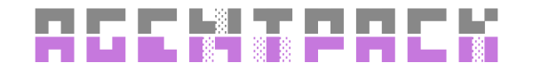

<p align="center">
  <picture>
    <source srcset="docs/assets/logo-dark.svg" media="(prefers-color-scheme: dark)">
    <source srcset="docs/assets/logo-light.svg" media="(prefers-color-scheme: light)">
    
  </picture>
</p>

<p align="center">An open package format for AI agent skills.</p>

<p align="center">
  <a href="https://github.com/retr0h/agentpack/releases/latest"></a>
  <a href="https://goreportcard.com/report/github.com/retr0h/agentpack"></a>
  <a href="LICENSE"></a>
  <a href="https://github.com/retr0h/agentpack/actions/workflows/go.yml"></a>
  <a href="https://codecov.io/gh/retr0h/agentpack"></a>
  <a href="https://conventionalcommits.org"></a>
  <a href="https://just.systems"></a>
  
  <a href="https://agentskills.io"></a>
</p>

<p align="center">
Install, manage, and distribute AI agent skills across Claude Code,
Cursor, Copilot, Codex, Gemini CLI, Windsurf, Goose, Roo, Amp, Cline,
and every agent supporting the <code>.agents/</code> convention.
</p>

## 📦 Install

```bash
curl -fsSL https://github.com/retr0h/agentpack/raw/main/install.sh | bash
```

### 🔨 Build from source

```bash
git clone https://github.com/retr0h/agentpack.git
cd agentpack
go build -o agentpack .
```

## 🚀 Quick Start

```bash
agentpack search react                            # find skills
agentpack add owner/repo@skill-name               # add a skill
agentpack add owner/repo --skill foo --skill bar  # add multiple skills
agentpack add owner/repo --target claude-code     # add to specific target
agentpack add owner/repo -g                       # add globally
agentpack ls                                      # list installed
agentpack ls --targets                            # show detected agents
agentpack info owner/repo                         # package details
agentpack del owner/repo                          # delete a plugin
agentpack del owner/repo@skill-name               # delete a single skill
agentpack init my-skill                           # scaffold a new skill
agentpack build                                   # build .agentpack archives
agentpack install                                 # install from manifest
```

See [Usage][] for full details.

## ✨ Features

- 📦 **[.agentpack format][Format]** — one package, every agent. Typed metadata with skills, commands, hooks, MCP, agents, and config
- 🤖 **50+ agents** — Claude Code, Cursor, Copilot, Codex, Gemini CLI, Windsurf, Goose, Roo, and more
- 🔒 **Content safety** — binary detection at build time, executable prompts at install
- 🔄 **Reproducible installs** — lockfile pins exact SHAs, `install` from manifest
- 🌐 **Global + local** — project-level or user-level installs (`-g`)
- ⚙️ **Config merging** — MCP servers, hooks, and settings merge into `.claude/settings.json`
- ✈️ **No toolchain required** — `.agentpack` files install without git, npm, or Go
- 📋 **JSON everywhere** — `-o json` on every command for scripting
- 📚 **Extensible** — write custom target drivers against the `pkg/target` interface

## 📐 The .agentpack format

A `.agentpack` file is a gzipped tarball with typed metadata. Each entry
declares its content type — the driver for each agent installs only what it
supports, wherever it belongs.

```
                                                          Installs to
.agentpack archive
┌──────────────────────┐
│  metadata.yaml       │
│                      │
│  k8s       skill    ─┼───→   Claude Code   .claude/skills/k8s/
│                     ─┼───→   Cursor        .cursor/rules/k8s/
│                     ─┼───→   Codex         .codex/skills/k8s/
│                      │
│  scan      command  ─┼───→   Claude Code   .claude/commands/scan/
│                      │
│  k8s-bot   agent    ─┼───→   Claude Code   .claude/agents/k8s-bot/
│                      │
│  my-api    mcp      ─┼───→   Claude Code   .claude/settings.json
│                      │
│  on-save   hook     ─┼───→   Claude Code   .claude/settings.json
│                      │
│  theme     config   ─┼───→   Claude Code   .claude/settings.json
│                      │
│                      │       Cursor, Codex skip unsupported types
└──────────────────────┘
```

Package authors write content once. Drivers install only the types they support.
When an agent adds support for a new type, existing packages work automatically.
See the [full specification][Format].

## 🔍 Discover Skills

```bash
agentpack search react
agentpack search typescript
agentpack search security
```

Browse the full catalog at [skills.sh](https://skills.sh).

## 📖 Documentation

- [Usage][] — add, install, build, verify, info, examples
- [Format (ADR-009)][Format] — the .agentpack specification
- [Architecture][] — driver design, install flow, capability model
- [Development][] — dev setup, testing conventions
- [Contributing][] — commit style, PR checklist

## 🙏 Acknowledgments

Agent detection paths and skill directory conventions inspired by
[vercel-labs/skills](https://github.com/vercel-labs/skills) and the
[agentskills.io](https://agentskills.io) ecosystem.

## 📄 License

[MIT][]

[MIT]: LICENSE
[Usage]: docs/usage.md
[Format]: docs/adr/009-metadata-driven-format.md
[Architecture]: docs/architecture.md
[Development]: docs/development.md
[Contributing]: docs/contributing.md
